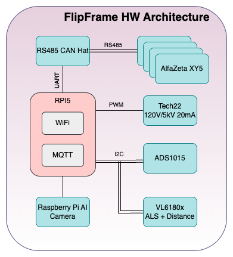
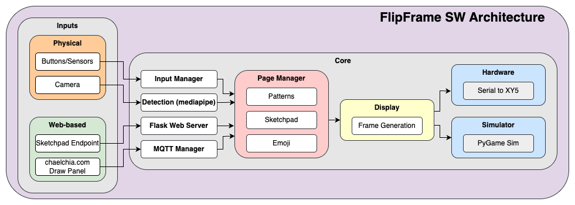

# overview
## introduction
FlipFrame is a Raspberry Pi powered flipdisc display. For now it runs in three primary modes: 
1. **Patterns** - serve as a passive display that elegantly and unintrusively flips discs in a variety of ways.
2. **Sketchpad** - allows for a user to draw whatever they can fit into a 28x28 grid, which isn't much but inspires creativity.
3. **Emoji** - humbles the user by reducing their face to a handful of pixels.

All modes provide a euphonic symphony of disc flips.

#### flipframe demo

## motivation
I came across some Alfazeta XY5 panels on eBay awhile back and thought they'd be fun to experiment with. At that time I had been seeing a bunch of online content from [Breakfast Studio](https://breakfaststudio.com/works), which has seemingly single-handedly reemerged and repurposed the flipdisc as an art medium in the last few years. Interestingly enough, the seller of the Alfazeta panels was Breakfast Studio themselves, presumably used by them to base their own in-house design off of and to benchmark against.

I didn't have any real goals with this project other than making it look good on a wall, and try out a couple concepts I was curious to see if I could make work, namely the sketchpad mode and camera integration. Maybe I'll add more features in the future but for now this project is primarily sits as an "analog" clock for our dining room.

## design
The FlipFrame is made up of 2 Alfazeta XY5 panels (28x14 discs in size) housed in a custom-made plywood frame. The panels are secured to a lasercut acrylic backplate which slides into routed channels on the inside surfaces of the plywood. A host of electronics are mounted to an interior plate that is fastened to the back of the panels, including the power supplies and the Raspberry Pi + expansion boards.

#### exploded view

### hw architecture
Aside from the frame itself, FlipFrame uses entirely off-the-shelf components:
- [Alfazeta XY5 panels](https://flipdots.com/en/products-services/flip-dot-boards-xy5/)
- [Raspberry Pi 5](https://www.raspberrypi.com/products/raspberry-pi-5/)
- [Raspberry Pi AI Camera Module](https://www.raspberrypi.com/products/ai-camera/)
- [120VAC -> 24VDC 100W supply](https://a.co/d/eNwp78p)
- [24VDC -> 5VDC power supply](https://a.co/d/8uwppEM)
- [ADS1015 ADC](https://a.co/d/4FIfxw3)
- [Waveshare RS485 CAN Hat](https://www.waveshare.com/wiki/RS485_CAN_HAT)
- [Adafruit VL6180x ToF sensor](https://www.adafruit.com/product/3316)
- [Tech22 120VAC -> 5kVAC power supply](https://www.t2-neonpower.com/PRODUCTS/NEON_SUPPLIES/5k20_120V_files/5k20_120V.html)

#### flipframe hardware architecture diagram

To control FlipFrame and navigate through it's pages, there are two buttons and a rotary potentiometer on the underside of the frame. The left button is used to cycle through the primary pages (pattern, sketchpad, emoji), and the right button is used to cycle through the seconardy pages within the primary pages (which for now is just the different patterns within the pattern page). The rotary potentiometer is used to adjust the speed of certain pattern animations.

Also on the underside of the frame is a breakout for a VL6180x ToF/ALS sensor and a Raspberry Pi AI Camera Module. The ToF sensor is used to detect physical presence in front of the frame, while the camera module is used for face detection and facial feature / gesture recognition which power the emoji page.

The AI Camera Module is overpowered for the purpose its fulfills right now - a Camera Module 3 would have been sufficient. The hope was to leverage its edge compute for future features, though.

### sw architecture
The FlipFrame's displays originate from a selected page's corresponding .py file, where each page renders a 28x28 frame. To navigate through the pages, a user can either utilize the physical hardware on the frame, which are handled through **input_manager**, or use the FlipFrame's web interface through chaelchia.com to publishMQTT topics, which are handled through **mqtt_manager**. Following generation, the 28x28 grid is then sent through **display**'s frame generator, which is then routed either to **hardware**'s serial driver or **simulator**'s Pygame display.

#### flipframe software architecture diagram

During bringup of this project, I wanted to be able test the visuals but not necessarily be chained down by the hardware. This led to the bringup of **FlipSim** - a Pygame powered SIL. It takes the same frames as what gets sent to the serial driver and renders them to the on-screen grid. This proved to be extremely useful for when I wanted to code on the couch and not at my desk. FlipSim is triggered through an `-s` build tag. 

#### flipsim demo

Prior to landing on MQTT to handle all comms, I experimented with using a Flask server to provide an endpoint `/submit_drawing` that a dedicated webpage could access to send drawings through. I was able to prove out a concept of scanning a QR code that produces a URL with an appended token. This URL provided exclusive access to the sketchpad page, which when drawn on, would send off post requests to that endpoint with a payload of the 28x28 grid and the token from the URL. To do this securely, I utilized an SSH-tunneling service to run on the FlipFrame through to the Linode. I eventually decided to pivot everything to MQTT for the sake of simplicity, but I've kept the Flask server in the codebase for reference.
